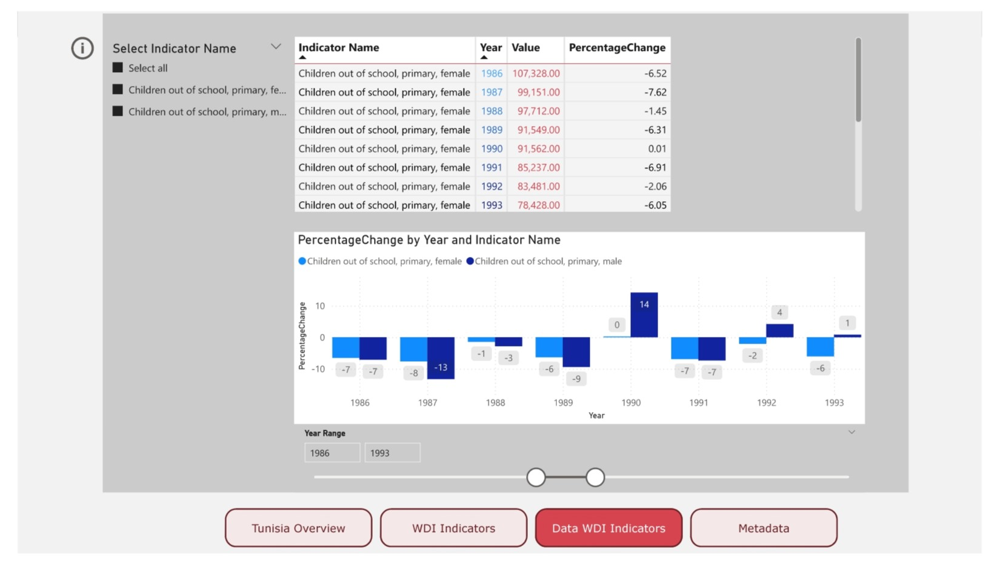

# Project Overview

A project for visualizing Tunisia's World Development Indicators (WDI) from the World Bank. This project aims to allow users to explore and interact with the data by selecting various topics and subtopics. The goal is to provide a user-friendly interface to visualize Tunisia's economic, social, and environmental indicators over time.

## 1. Tunisia Overview

The first page, **Tunisia Overview**, presents general information about Tunisia, including key demographic, economic, and social indicators. This page provides the user with an understanding of the country's status and general trends.

## 2. WDI Indicators Visualization

The second page, **WDI Indicators**, allows users to select specific topics and indicators to visualize through line charts. Users can select indicators based on various topics such as education, health, economic performance, etc. 

- **Indicator Selection**: A slicer is provided for the user to choose specific WDI indicators.
- **Line Chart Visualization**: Displays trends over time for the selected indicators, helping users analyze the data visually and understand trends.

## 3. Data WDI Indicators

The third page, **Data WDI Indicators**, presents the actual data for the selected WDI indicators. It includes tables with raw data and a bar chart to visualize the **percentage change by year** for each indicator.

## 4. Metadata for Indicators

The final page, **Metadata**, provides detailed metadata for the selected indicators. This includes descriptions, units of measurement, source information, and other relevant details for each indicator.

## Contributions

Any contributions or suggestions are more than welcome and greatly appreciated!

